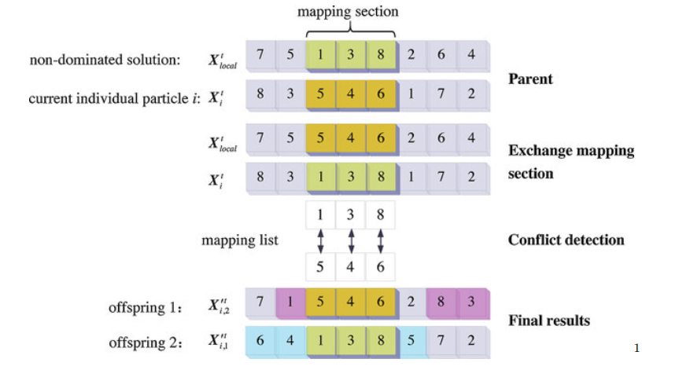
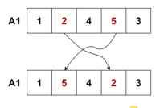
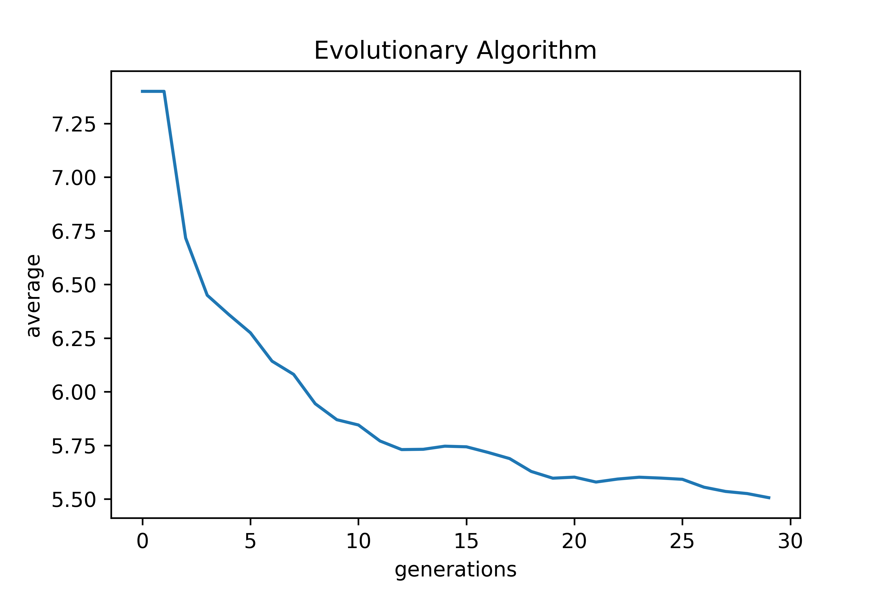
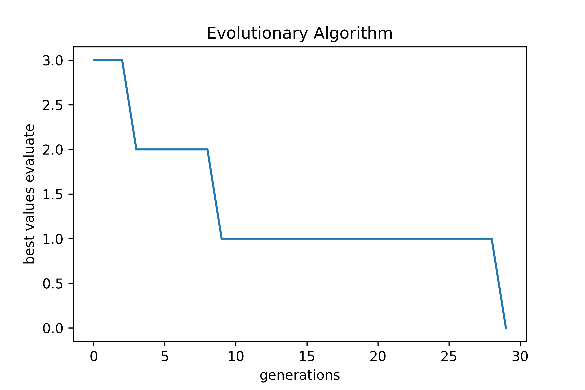

# Evolutionary Algorithm

## General info
In computational intelligence (CI), an evolutionary algorithm (EA) is a subset of evolutionary computation, a generic population-based metaheuristic optimization algorithm. An EA uses mechanisms inspired by biological evolution, such as reproduction, mutation, recombination, and selection. Candidate solutions to the optimization problem play the role of individuals in a population, and the fitness function determines the quality of the solutions (see also loss function). Evolution of the population then takes place after the repeated application of the above operators. LINK: https://en.wikipedia.org/wiki/Evolutionary_algorithm

### Program info
The program is an implementation of an evolutionary algorithm for finding a solution for n-hetmans (The eight queens puzzle is the problem of placing eight chess queens on an 8×8 chessboard so that no two queens threaten each other.). 

## Evolutionary Algorithm Pseudocode 
```
P <- P0
evaluate(P)
gen <- 0
best <- min(evaluate(P))
while { gen < genMAX ^ evaluate(P(best)) > ffmax } do
  Pn <- selection(P)
  crossover(Pn)
  mutation(Pn)
  evaluate(Pn)
  best <- min(evaluate(Pn))
  P <- Pn
  gen <- gen + 1
end while
return P(best), evaluate(P(best))
```
## Technologies
Program is created with:
* Python

## Description of the algorithm
* Each individual represents an array of n-hetmans. An individual is a vector of length n. The interpretation of an individual is as follows: the index in the vector, is the x-coordinate and the value in the vector is the y-coordinate.
* <b>P</b> population (set of potential settings of hetmans on a chessboard) - an array with a given number of pop individuals.
* <b>P0</b> is the initial population, which is a pop-size array with n-hetmans whose positions are random - (perform randomization by drawing permutations from n).
* <b>evaluate(P)</b> computes an adaptation function for the n-hemtans problem that returns the number of attacks.
* <b>best</b> - the index of the best individual in the population P
* <b>Pn</b> is the new population after selection
* <b>selection(P)</b> tournament selection:

```
while i < pop do
  i1 <- random(pop)
  i2 <- random(pop)
  if i1 != i2 then
    if evaluate(P(i1)) <= evaluate(P(i2)) then
      Pn(i) <- P(i1)
    else
      Pn(i) <- P(i2)
    end if
    i <- i + 1
  end if
end while
```

* <b>ffMAX</b> is the expected value of the adaptation/utility function for the solution. For the n-hetman problem, it is the smallest number of attacks, that is 0.
* <b>genmax</b> - maximum number of evolutionary algorithm steps (generation) 1000
* <b>crossover(Pn)</b> function changes individuals by exchanging information contained in two randomly selected individuals.

```
while i < pop - 2 do 
  if random() <= pc then
    cross(P(i), P(i + 1))
    i <- i + 2
  end if
end while
```

<b>pc</b> - crossover probability - a parameter that controls the number of crossovers.

<b>random()</b> - returns real values from 0 to 1.

The <b>cross</b> function performs crossover using the PMX (partially mapped crossover) method shown in the diagram. The "mapping section" is randomized for each pair, which means it can have different size and position

<p align="center">

</p>

* <b>mutation(Pn)</b> function changes individuals randomly according to the scheme

```
while i < pop do
  if random() <= pm then
    mutate(P(i))
    i <- i + 1
  end if
end while
```

<b>pm</b> - mutation probability - parameter controlling the number of mutations.

<b>random()</b> - returns real values from 0 to 1.

The <b>mutate</b> function is to exchange two randomly chosen hetmans.

<p align="center">

</p>

## Initial data
* <b>n</b> - size of the chessboard and the number of hetmans
* <b>pop</b> - the number of individuals in the population: for example 10 or 100
* <b>genmax</b> - the maximum number of generations, for example 1000 or 10000
* <b>pc</b> - crossover discriminator, e.g. 0.7 or 0.9
* <b>pm</b> - mutation discriminator, e.g. 0.2 or 0.5

## Performance
Solve for the best individual - showing the positions of the hetmans on the chessboard and the number of beats. In addition, the generated graph of variation of the value of the best individual's adaptation function in generations and the average value of the adaptation function from a given population also in generations (axis X - generations, axis Y - value of the adaptation function).

## Results on the graph

<p align="center">
 
</p>
