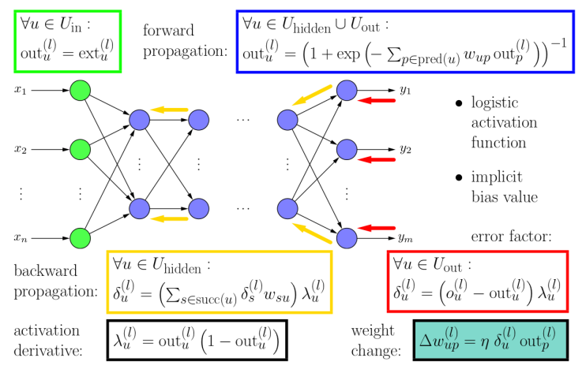
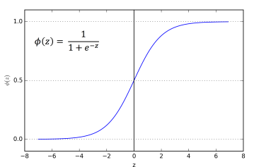

# Multilayer Perceptron

## General info
Is a class of feedforward artificial neural network (ANN). The term MLP is used ambiguously, sometimes loosely to any feedforward ANN, sometimes strictly to refer to networks composed of multiple layers of perceptrons (with threshold activation). The program is an implementation of an algorithm for learning a multilayer network (limited to 1 hidden layer) with a backward error propagation algorithm. The learning will be done using the Iris collection.

## Graphical scheme
The following diagram shows the backpropagation teaching assumptions
<p align="center">

</p>
Author: Christian Borgelt

## Technologies
Programs is created with:
* Python

## Next points in the algorithm
1. Load the dataset using the code below:
```
from sklearn.datasets import fetch_openml

X_iris, y_iris = fetch_openml(name="iris", version=1, return_X_y=True)
```
2. The loaded set has as output a vector containing data of type str of dimension [number samples, 1]. It needs to be transformed into an array of size [number of samples, number of classes], where
* 'Iris-setosa' –> [1. 0. 0.],
* 'Iris-versicolor' –> [0. 1. 0.],
* 'Iris-virginica' –> [0. 0. 1.].
3. Make a distinction between the teaching set and the testing set
```
from sklearn.model_selection import train_test_split

X_train, X_test, y_train, y_test = train_test_split(X_iris, y_iris_coded, random_state=13)
```

### MLP class - neural classifier
1. Implement the MLP class
```
class MLP(object):
  def __init__(...
```
Parameters:
* hidden : int (default: 10): Number of hidden neurons.
* epochs : int (default: 100): The number of steps of presentation of training set samples.
* eta : float (default: 0.1): Learning rate.
* shuffle : bool (default: True): Shuffles the learning data in each epoch.
2. Implement a method in the class:
```
def_sigmoid(self, z):
```
that computes the logistic function as a transfer function according to the formula below: 

<p align="center">

</p>

3. Implement in your class a method that calculates the output of a MLP network - forward step for given input matrix X:
```
def _forward(self, X):
```
4. Implement the cost function method in your class - (MultiClass Cross-Entropy Loss) Link: https://towardsdatascience.com/cross-entropy-for-classification-d98e7f974451
```
def _compute_cost(self, y, output):
```
5. Implement a fit method in the class that performs network learning using backward propagation of errors:
```
def fit(self, X_train, y_train):
```
6. Implement a predict method in the class that returns the class for the input:
```
def predict(self, X):
```
Compute for the given X the output of the network with the help of _forward. Calculate what class was indicated and this value is returned by the method.

## Results on the graph

### Binary data
<p align="center">
 
</p>

### Normalized data
<p align="center">
 
</p>

### Test data
<p align="center">
 
</p>

### Training data
<p align="center">
 
</p>

## Conclusions:
* Classification of data taken from iris for training and testing data is very similar
* Classification of binary data once had an increase in data for cost and a slight decrease for accuracy
* Similar to the binary data classification normalized data from iris had similar graphs
* The graphs changed as the bottoms changed but always the graphs associated with cost converged down and accuracy converged up

## Starting Questions
1. how many inputs will the network have and from what does this result?
2. how many outputs will the network have and from what does this result?
3. what will be the activation function in the neurons?
4. What loss function should I choose for the task at hand?

## Answers
1. there are as many inputs as there are features (in our case 4). It always so no matter what the task, the number of inputs to the neural network, the number of features and attributes in a given set
2. outputs are as many as classes (in our case 3). We always rely on the task
3. depends on the task, and in our case was selected sigmoidal function
4. also depends on the task (our multinomial option is multiple outputs) and in our case we used Multi-Class Cross-Entropy Loss
