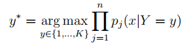
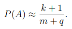

# Naive Bayes Classifiers

## General Info
The discrete variant of NBC learning consists in determining and storing (in some
data structure, for example in an array or dictionary) of all possible probabilities
which may be needed as factors in formula. 

Identifying probabilities with the frequencies occurring in the learning set.

## First step
Download the data for the "wine" set from the UCI repository 
### Link
https://archive.ics.uci.edu/ml/datasets/Wine

## Next points in the algorithm
1. Loading the data from the downloaded text file wine.data into a numpy matrix (using the numpy.genfromtxt function) and splitting this matrix into two matrices X (of dimension
178 × 13) and y (178 × 1 - class labels).
2. Wine data discretization using a ready-made object
KBinsDiscretizer
3. Split the data into learning and test parts (using the train_test_split function from the sklearn.model_selection package)
4. Create a Bayes class. Prepare the class according to the idea of scikit-learn library - among others:
inheritance from BaseEstimator and ClassifierMixin classes, prepare fit
(learning) and predict (classifying) methods and auxiliary predict_problems.
5. Data structures for storing:
* a priori distributions of classes P(Y = y),
* the conditional distributions P(Xj = v|Y = y).
6. Determine the accuracy (Accuracy = NP LZ ∗ 100%, where NP - the number of samples properly classified
classified in the set, LZ - the size of the set) of the obtained classifier
on the learning and test sets.
7. Repeat the calculation taking into account the LaPlace correction

