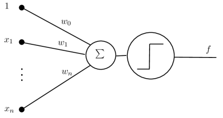
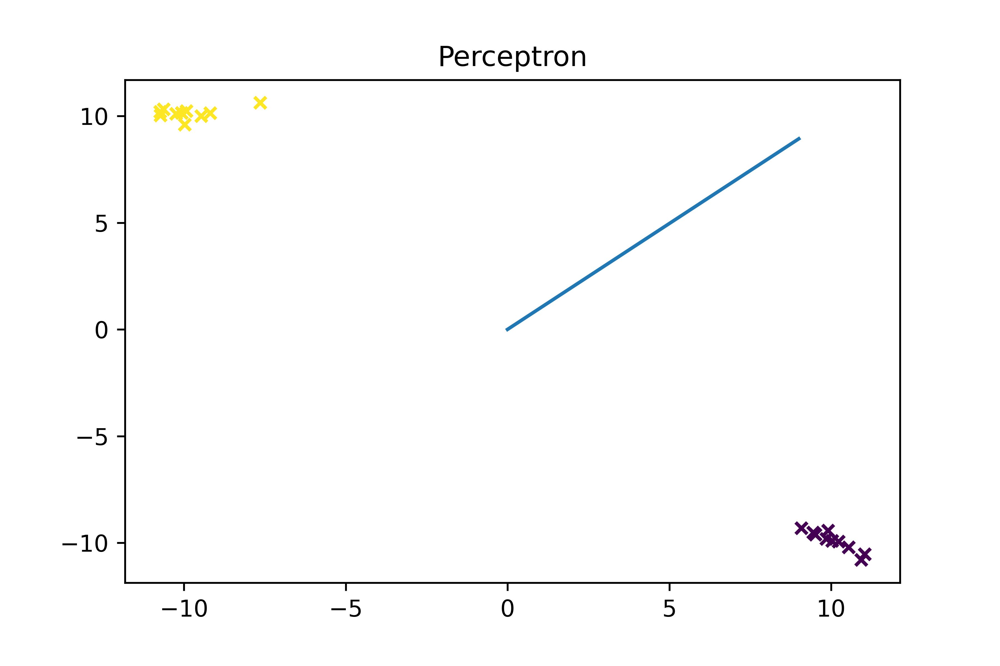

# Perceptron

## General info
Perceptron algorithm is the simplest type of artificial neural network.
It is a single neuron model that can be used to solve
classification problems of two classes and forms the basis for the later development of much
larger networks.

## Graphical scheme

## Technologies
Program is created with:
* Python

## Next points in the algorithm
We assume that a learning set consisting of m points xi and the corresponding
expected outputs yi.
1. Let w(0) = (0,...,0)
2. k = 0
3. As long as the set of learning points remains misclassified that is, the set E = { xi : yi != f(s)} remains non-empty, repeat:

(a) Draw from the set E any pair (xi : yi)

(b) Update the scales according to the following rule:

w(k + 1) = w(k) + nyixi

(c) k = k + 1

## Results on the graph

